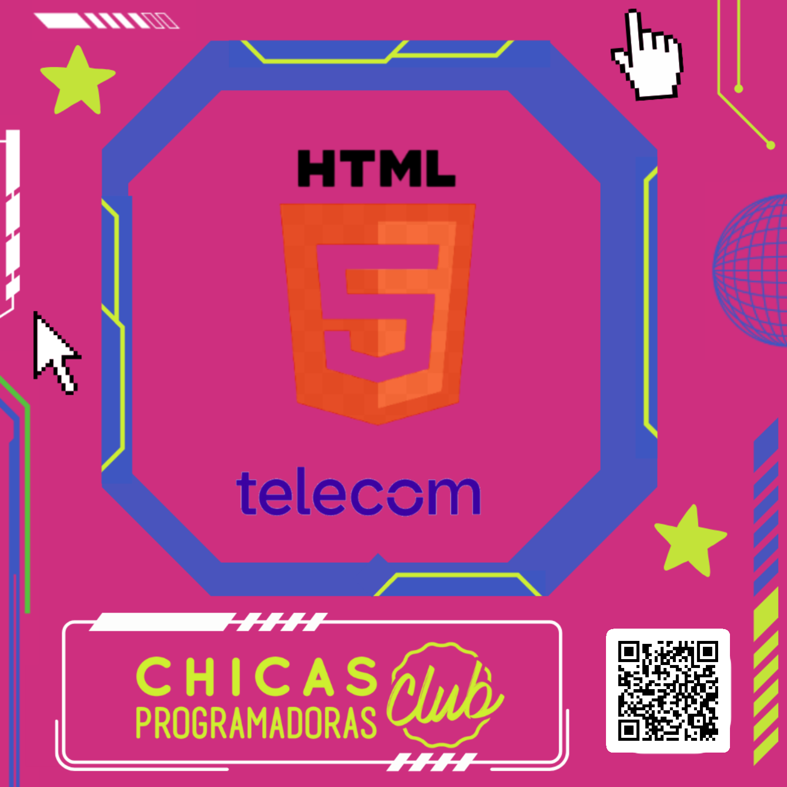
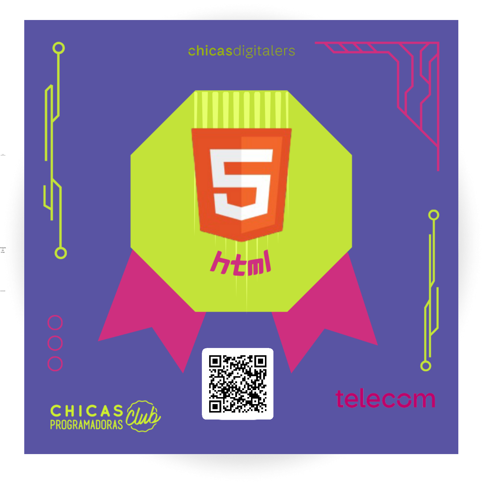

## Hello everyone! It's Mitchie 👋
💻 Currently studying to be a web designer, self-taught cybersecurity newbie and computer enthusiast.

### 🌈 About me
- 🌱 I'm learning **HTML and CSS**
- 💻 Also i'm slowly learning and practicing Cibersecurity everyday.
- 🎧 I really love alternative music like post-hardcore and some sub-genres of metal.
- 🐧 Learning how to use LINUX, specifically Kali Linux

  ### 💡 Projects
    <h1>My Linus Torvalds page: https://mitchiefoos.github.io/mi-proyecto/</h1>

  ### 🏅Badges!
 img { 
 display: flex;
 flex-direction: row;
 }
 

<!--
**MitchieFoos/MitchieFoos** is a ✨ _special_ ✨ repository because its `README.md` (this file) appears on your GitHub profile.

Here are some ideas to get you started:

- 🔭 I’m currently working on ...
- 🌱 I’m currently learning ...
- 👯 I’m looking to collaborate on ...
- 🤔 I’m looking for help with ...
- 💬 Ask me about ...
- 📫 How to reach me: ...
- 😄 Pronouns: ...
- ⚡ Fun fact: ...
-->
